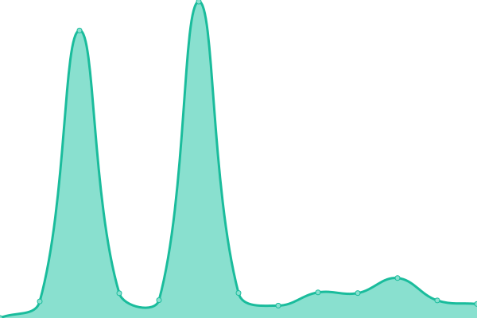
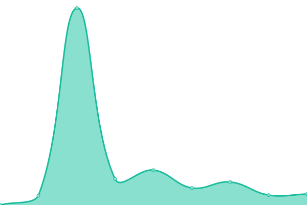
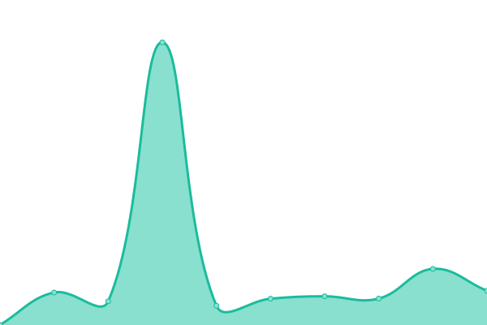
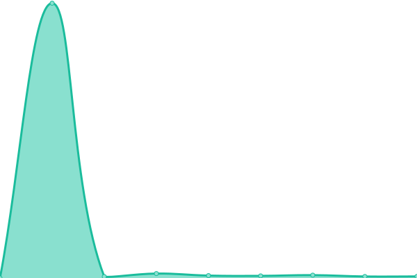
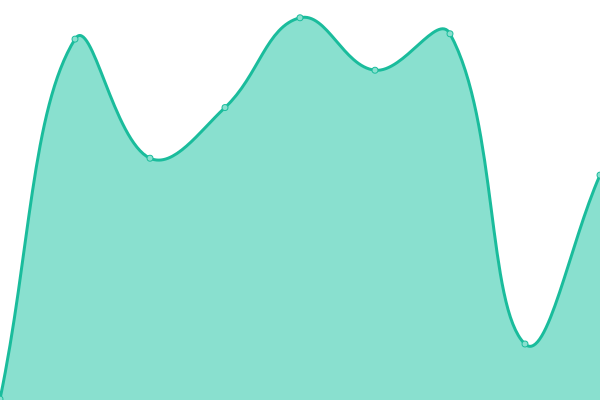
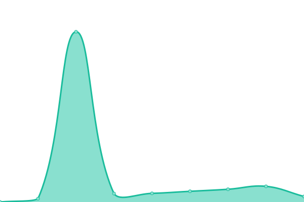

# [📈 Live Status](https://demo.upptime.js.org): <!--live status--> **🟩 All systems operational**

This repository contains the open-source uptime monitor and status page for [Red Rock Web Design](https://demo.upptime.js.org), powered by [Upptime](https://github.com/upptime/upptime).

With [Upptime](https://upptime.js.org), you can get your own unlimited and free uptime monitor and status page, powered entirely by a GitHub repository. We use [Issues](https://github.com/Red Rock Web Design/upptime-monitor/issues) as incident reports, [Actions](https://github.com/Red Rock Web Design/upptime-monitor/actions) as uptime monitors, and [Pages](https://demo.upptime.js.org) for the status page.

<!--start: status pages-->
<!-- This summary is generated by Upptime (https://github.com/upptime/upptime) -->
<!-- Do not edit this manually, your changes will be overwritten -->
<!-- prettier-ignore -->
| URL | Status | History | Response Time | Uptime |
| --- | ------ | ------- | ------------- | ------ |
|  [red-rock-web-design](https://www.redrockwebdesign.com) | 🟩 Up | [red-rock-web-design.yml](https://github.com/Red-Rock-Web-Design/upptime-monitor/commits/HEAD/history/red-rock-web-design.yml) | 

 424ms
     
 | 

<a href="https://Red-Rock-Web-Design.github.io/upptime-monitor/history/red-rock-web-design">100.00%</a>
    

|  [priority-1-communications](https://www.priority1communications.com) | 🟩 Up | [priority-1-communications.yml](https://github.com/Red-Rock-Web-Design/upptime-monitor/commits/HEAD/history/priority-1-communications.yml) | 

 421ms
     
 | 

<a href="https://Red-Rock-Web-Design.github.io/upptime-monitor/history/priority-1-communications">100.00%</a>
    

|  [the-school-solution](https://theschoolsolution.com) | 🟩 Up | [the-school-solution.yml](https://github.com/Red-Rock-Web-Design/upptime-monitor/commits/HEAD/history/the-school-solution.yml) | 

 167ms
     
 | 

<a href="https://Red-Rock-Web-Design.github.io/upptime-monitor/history/the-school-solution">100.00%</a>
    

|  [nielson-zoltan](https://nielsonzoltan.com) | 🟩 Up | [nielson-zoltan.yml](https://github.com/Red-Rock-Web-Design/upptime-monitor/commits/HEAD/history/nielson-zoltan.yml) | 

 249ms
     
 | 

<a href="https://Red-Rock-Web-Design.github.io/upptime-monitor/history/nielson-zoltan">99.72%</a>
    

|  [vibrant-cans](https://vibrantcans.com) | 🟩 Up | [vibrant-cans.yml](https://github.com/Red-Rock-Web-Design/upptime-monitor/commits/HEAD/history/vibrant-cans.yml) | 

 269ms
     
 | 

<a href="https://Red-Rock-Web-Design.github.io/upptime-monitor/history/vibrant-cans">100.00%</a>
    

|  [the-pool-medic](https://thepoolmedic.org) | 🟩 Up | [the-pool-medic.yml](https://github.com/Red-Rock-Web-Design/upptime-monitor/commits/HEAD/history/the-pool-medic.yml) | 

 304ms
     
 | 

<a href="https://Red-Rock-Web-Design.github.io/upptime-monitor/history/the-pool-medic">100.00%</a>
    

|  [the-grateful-dog-la](https://thegratefuldogla.com) | 🟩 Up | [the-grateful-dog-la.yml](https://github.com/Red-Rock-Web-Design/upptime-monitor/commits/HEAD/history/the-grateful-dog-la.yml) | 

 315ms
     
 | 

<a href="https://Red-Rock-Web-Design.github.io/upptime-monitor/history/the-grateful-dog-la">100.00%</a>
    

<!--end: status pages-->

[**Visit our status website →**](https://demo.upptime.js.org)

## 📄 License

- Powered by: [Upptime](https://github.com/upptime/upptime)
- Code: [MIT](./LICENSE) © [Anand Chowdhary](https://anandchowdhary.com), supported by [Pabio](https://pabio.com)
- Data in the `./history` directory: [Open Database License](https://opendatacommons.org/licenses/odbl/1-0/)
